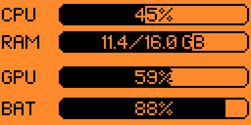
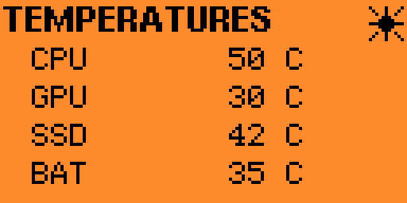

# Flipper PC Monitor Suite

A macOS-to-Flipper Zero system monitor built around Bluetooth Low Energy, Flipper RPC, a custom PC Monitor FAP, a Rust macOS backend, and a Python BLE RPC utility.

The project displays live Mac system information on the Flipper Zero screen and includes additional BLE/RPC tooling for development, deployment, and troubleshooting.

## Screenshots

### Main system monitor



The main screen displays:

- CPU utilization
- RAM utilization and total memory
- GPU utilization
- Mac battery percentage

### Temperature monitor



The temperature screen displays:

- CPU temperature
- GPU temperature
- SSD temperature
- Battery temperature

---

## Repository Layout

```text
flipper-pc-monitor-suite/
├── flipper-fap/               Flipper Zero PC Monitor application
├── mac-backend/               Rust macOS telemetry + BLE/RPC backend
├── flipperble/                Python BLE RPC command-line client
├── firmware/
│   ├── README.md              Momentum firmware patch documentation
│   └── patches/
│       └── momentum-mntm-012-pc-monitor.patch
├── docs/
│   └── images/
│       ├── pc-monitor-main.png
│       └── pc-monitor-temperatures.png
└── README.md
```

## High-Level Architecture

```text
┌─────────────────────────────┐
│          macOS              │
│                             │
│  System telemetry           │
│  ├─ CPU                     │
│  ├─ RAM                     │
│  ├─ GPU                     │
│  ├─ Battery                 │
│  └─ Temperatures            │
│            │                │
│            ▼                │
│  flipper-pc-monitor-backend │
│       Rust / CoreBluetooth  │
└─────────────┬───────────────┘
              │
              │ BLE advertising discovery
              │ + Flipper RPC transport
              ▼
┌─────────────────────────────┐
│        Flipper Zero         │
│                             │
│  Momentum firmware patch    │
│            │                │
│            ▼                │
│      PC Monitor FAP         │
│            │                │
│            ▼                │
│       Flipper display       │
└─────────────────────────────┘
```

`flipperble` is a separate command-line utility that talks to the same Flipper RPC service over BLE and is useful for deployment and diagnostics.

---

# Components

## 1. Flipper PC Monitor FAP

Location:

```text
flipper-fap/
```

The FAP is responsible for:

- displaying telemetry received from macOS;
- displaying CPU, RAM, GPU and battery information;
- displaying CPU/GPU/SSD/battery temperatures;
- requesting an RPC session through the custom advertising flag;
- handling RPC-mode startup;
- returning to an idle state when PC Monitor is closed.

The application is designed to work with the custom Momentum advertising changes included in this repository.

### Application ID

```text
pc_monitor
```

### FAP location on the Flipper SD card

```text
/ext/apps/Bluetooth/pc_monitor.fap
```

The macOS backend is expected to start this exact path through Flipper RPC.

---

## 2. macOS Backend

Location:

```text
mac-backend/
```

The backend is written in Rust and performs three main jobs:

1. Collect system telemetry from macOS.
2. Discover and connect to the Flipper over CoreBluetooth.
3. Send compact binary telemetry through the Flipper RPC session.

### Telemetry sources

The backend collects or derives:

- CPU utilization
- RAM total
- RAM utilization
- GPU utilization
- Mac battery percentage
- CPU temperature
- GPU temperature
- SSD temperature
- Battery temperature

The GPU/temperature implementation uses the vendored `macmon` code where appropriate.

### RAM utilization

RAM utilization is calculated by the backend, not by the Flipper:

```text
RAM usage % = used memory / total memory × 100
```

The FAP receives the already-calculated percentage.

### Backend state machine

The stabilized backend uses a centralized connection state machine rather than multiple independent connection flags.

```text
Scanning
   │
   ▼
Connecting
   │
   ▼
RpcReady
   │
   ▼
AppRunning
   │
   ├──────────────► Recovering ──────► Scanning
   │
   ▼
WaitingForIdle
   │
   ▼
Scanning
```

Typical transitions include:

```text
State Scanning -> Connecting
State Connecting -> RpcReady
State RpcReady -> AppRunning
State AppRunning -> WaitingForIdle
State WaitingForIdle -> Scanning
```

This architecture avoids races where the BLE scanner, RPC worker and reconnect watchdog independently attempt to control the same connection.

### Recovery behavior

Temporary BLE/RPC failures are treated as session failures instead of immediately terminating the entire backend.

The backend attempts to:

- cleanly disconnect a broken RPC session;
- restart BLE scanning;
- reject stale advertising requests;
- recover after Flipper reboot/disconnect;
- avoid duplicate disconnect handling;
- guard against unrelated BLE devices being selected as the reconnect target.

A process-level restart is retained only as a last-resort watchdog mechanism for repeated CoreBluetooth failure.

---

# BLE Advertising Protocol

PC Monitor uses a small manufacturer-specific advertising extension.

The PC Monitor-specific portion is:

```text
46 5A 01 BAT FLAGS
```

| Field | Size | Meaning |
|---|---:|---|
| `46 5A` | 2 bytes | PC Monitor signature |
| `01` | 1 byte | Advertising protocol version |
| `BAT` | 1 byte | Flipper battery percentage |
| `FLAGS` | 1 byte | PC Monitor request/state flags |

This sequence appears inside the larger manufacturer-specific advertising payload.

The Momentum patch checks the PC Monitor signature and version before updating battery data.

### Request flag

The backend monitors the advertising `FLAGS` field.

A PC Monitor request is signaled through the advertising state, allowing the Mac to discover that the FAP wants an RPC connection without maintaining a permanent BLE connection.

---

# Telemetry Protocol

The current application telemetry payload is a fixed **14-byte binary packet**.

## Packet Layout

| Offset | Size | Type | Field |
|---:|---:|---|---|
| 0 | 1 | `uint8_t` | CPU usage % |
| 1 | 2 | `uint16_t` | RAM total |
| 3 | 1 | `uint8_t` | RAM usage % |
| 4 | 4 | `char[4]` | RAM unit |
| 8 | 1 | `uint8_t` | GPU usage % |
| 9 | 1 | `uint8_t` | Mac battery % |
| 10 | 1 | `uint8_t` | CPU temperature |
| 11 | 1 | `uint8_t` | GPU temperature |
| 12 | 1 | `uint8_t` | SSD temperature |
| 13 | 1 | `uint8_t` | Battery temperature |

Total:

```text
1 + 2 + 1 + 4 + 1 + 1 + 1 + 1 + 1 + 1 = 14 bytes
```

### Equivalent packed C structure

```c
#pragma pack(push, 1)
typedef struct {
    uint8_t cpu_usage;
    uint16_t ram_max;
    uint8_t ram_usage;
    char ram_unit[4];
    uint8_t gpu_usage;
    uint8_t battery_usage;
    uint8_t cpu_temp;
    uint8_t gpu_temp;
    uint8_t ssd_temp;
    uint8_t battery_temp;
} DataStruct;
#pragma pack(pop)
```

`#pragma pack(..., 1)` prevents the compiler from inserting alignment padding between fields.

### RAM unit

The current protocol reserves four bytes for the RAM unit, for example:

```text
'G' 'B' '\0' '\0'
```

A future protocol revision could remove this field if the display is always expressed in GB.

### Sentinel values

A value of `255` (`u8::MAX`) is used by some backend paths as an unavailable/not-yet-sampled sentinel.

---

# Possible Protocol v2

A future revision could add:

- protocol version;
- packet sequence number;
- CRC-8;
- explicit validity flags.

A sequence number would make it possible to detect missed or duplicated telemetry updates.

CRC-8 is not required for BLE link integrity, but it can provide application-level validation and catch version/layout mismatches.

---

# RPC Lifecycle

A simplified startup sequence is:

```text
1. User opens PC Monitor on Flipper.
2. FAP sets the PC Monitor request flag in BLE advertising.
3. macOS backend observes FLAGS requesting RPC.
4. Backend connects to the Flipper RPC service.
5. Backend waits for the bootstrap FAP handoff.
6. Backend sends App.Start for:
      /ext/apps/Bluetooth/pc_monitor.fap
   with the RPC argument.
7. RPC-mode PC Monitor starts.
8. Backend sends telemetry.
9. User exits PC Monitor.
10. RPC session disconnects.
11. BLE scanning resumes.
```

The backend must launch:

```text
/ext/apps/Bluetooth/pc_monitor.fap
```

Do not leave an older `pc_monitor_dev.fap` path hardcoded in the backend.

---

# Momentum Firmware Patch

Location:

```text
firmware/patches/momentum-mntm-012-pc-monitor.patch
```

The patch changes only:

```text
targets/f7/ble_glue/gap.c
targets/f7/furi_hal/furi_hal_bt.c
```

It has been validated with `git apply --check` against a clean worktree.

## Tested base

```text
Momentum: mntm-012
Git commit: 24302ed6a8e3b682351d18e4f234255445b0d234
Firmware API: 87.1
```

### `gap.c`

Battery advertising updates are restricted to the PC Monitor protocol version:

```c
gap->service.mfg_data[4] == 0x46 &&
gap->service.mfg_data[5] == 0x5A &&
gap->service.mfg_data[6] == 0x01
```

### `furi_hal_bt.c`

`furi_hal_bt_update_advertising_flags()` is hardened so that it:

- always updates cached manufacturer data;
- avoids HCI advertising restart when Bluetooth is inactive;
- suppresses redundant updates when flags did not change;
- restarts advertising only while GAP is actively advertising;
- uses the regular GAP lifecycle.

See `firmware/README.md` for additional details.

---

# Building the Flipper FAP

Use a compatible Momentum source tree.

```bash
cd /path/to/Momentum-Firmware
```

Copy the FAP source:

```bash
rm -rf applications_user/pc_monitor
cp -R /path/to/flipper-pc-monitor-suite/flipper-fap       applications_user/pc_monitor
```

Build:

```bash
./fbt fap_pc_monitor
```

Typical output:

```text
build/f7-firmware-C/.extapps/pc_monitor.fap
```

Locate it with:

```bash
find build -iname "*pc*monitor*.fap" -print
```

If `fbt` prints:

```text
Duplicate app declaration: pc_monitor
```

check for duplicate manifests:

```bash
grep -RIl 'pc_monitor' applications applications_user   --include='application.fam' 2>/dev/null
```

---

# Uploading the FAP over Bluetooth

```bash
flipperble put build/f7-firmware-C/.extapps/pc_monitor.fap /ext/apps/Bluetooth/pc_monitor.fap
```

---

# Building the macOS Backend

Requirements:

- macOS
- Rust/Cargo
- Bluetooth enabled
- Flipper paired with the Mac

Build:

```bash
cd mac-backend
cargo check
cargo build --release
```

Binary:

```text
target/release/flipper-pc-monitor-backend
```

Run manually:

```bash
./target/release/flipper-pc-monitor-backend
```

Typical startup:

```text
RPC proxy listening on /tmp/flipper-pcmonitor-rpc.sock
Found "CoreBluetooth" adapter
Scanning for Flipper RPC...
```

---

# Installing the macOS Backend

Installed binary location used during development:

```text
/Applications/Flipper/flipper-pc-monitor-backend
```

Replace it with:

```bash
sudo cp target/release/flipper-pc-monitor-backend /Applications/Flipper/flipper-pc-monitor-backend
```

LaunchAgent identifier used during development:

```text
com.flipper.pcmonitor
```

Restart:

```bash
launchctl bootout gui/$(id -u) ~/Library/LaunchAgents/com.flipper.pcmonitor.plist 2>/dev/null

launchctl bootstrap gui/$(id -u) ~/Library/LaunchAgents/com.flipper.pcmonitor.plist
```

Verify:

```bash
pgrep -fl flipper-pc-monitor
```

Follow the log:

```bash
tail -f /tmp/flipper-pcmonitor.log
```

---

# flipperble

`flipperble` is a macOS BLE RPC client used for interacting with Flipper Zero without USB.

Current commands include:

```text
info
battery
advbattery
pcmon-start
cat
log
ls
put
run
rm
mkdir
mv
cli
```

Examples:

```bash
flipperble info
flipperble battery
flipperble advbattery
flipperble ls /ext
flipperble cat /ext/path/to/file
flipperble put local.file /ext/path/remote.file
flipperble run /ext/apps/Bluetooth/pc_monitor.fap
```

## Interactive shell

```bash
flipperble cli
```

This is an interactive BLE RPC shell, not the native Flipper serial CLI.

Native firmware commands such as:

```text
log debug
log trace
free
top
```

require a firmware-side CLI/RPC bridge if they are to be streamed over BLE.

---

# Debugging

Backend log:

```bash
tail -f /tmp/flipper-pcmonitor.log
```

Useful state transitions include:

```text
State Scanning -> Connecting
State Connecting -> RpcReady
State RpcReady -> AppRunning
State AppRunning -> WaitingForIdle
State WaitingForIdle -> Scanning
```

For native Flipper runtime logging, USB CLI remains the most direct diagnostic interface:

```text
log debug
```

or:

```text
log trace
```

Persistent breadcrumbs may also be added under:

```text
/ext/apps_data/pc_monitor/
```

and later read with `flipperble cat`.

---

# Common Problems

## `GPU=255` or `BAT=255`

`255` means unavailable/not initialized on some backend paths.

## App appears to close and reopen

Check that:

1. the FAP uploaded to the Flipper is current;
2. the backend launches `/ext/apps/Bluetooth/pc_monitor.fap`;
3. only one `pc_monitor` manifest is active in the Momentum tree.

## `flipperble put` encryption timeout

If CoreBluetooth reports an encryption timeout, verify the BLE RPC connection first:

```bash
flipperble info
```

Then retry the upload.

---

# Development Notes

Keep protocol definitions synchronized between:

- Rust serialization in the macOS backend;
- C parsing/structure layout in the FAP.

Do not commit local build output such as:

```text
target/
build/
dist/
*.fap
*.elf
.DS_Store
__pycache__/
```

The macOS backend includes vendored `macmon` sources. Preserve the relevant license information.

---

# Compatibility

Known development environment:

- Flipper Zero
- Momentum Firmware `mntm-012`
- Firmware API `87.1`
- macOS on Apple Silicon
- CoreBluetooth
- Rust backend
- Python `flipperble`

Always run:

```bash
git apply --check firmware/patches/momentum-mntm-012-pc-monitor.patch
```

against a clean checkout of the target Momentum revision before applying the firmware patch.

---

# Roadmap

Potential future improvements:

- protocol v2 with version field;
- telemetry sequence number;
- CRC-8 validation;
- validity bitmask instead of `255` sentinel values;
- smaller or fixed RAM unit representation;
- native firmware log streaming over BLE;
- persistent FAP crash breadcrumbs;
- improved CPU sampling;
- automatic compatibility testing against newer Momentum releases.

---

# License

See the license files inside the individual project components.

When redistributing vendored or upstream-derived code, preserve the applicable upstream license and attribution files.
